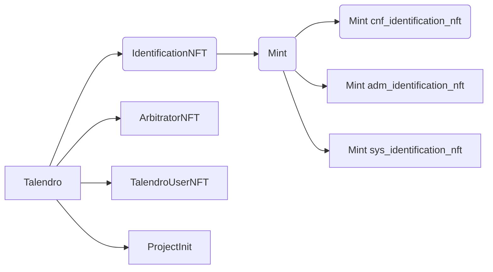
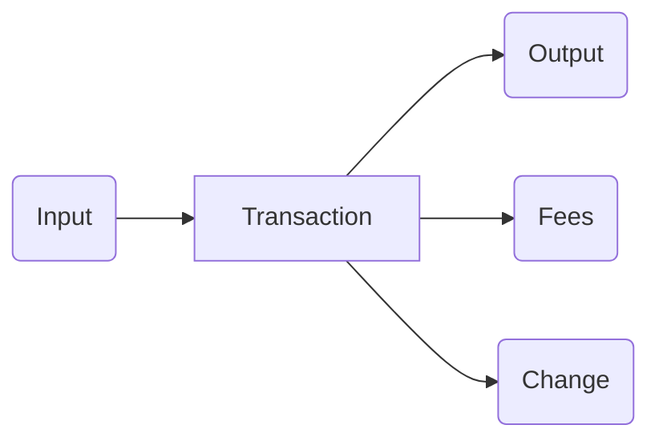

```mermaid
graph LR
    Talendro --> C1(IdentificationNFT)
    Talendro --> ArbitratorNFT
    Talendro --> TalendroUserNFT
    Talendro --> ProjectInit
      C1 -->  A1(Mint) --> B1(Mint cnf_identification_nft)
        A1 --> B2[Mint adm_identification_nft]
        A1 --> B3[Mint sys_identification_nft]

```

```mermaid
graph LR
    TX[Transaction]
    I1(Input)
    O1(Output)
    O2(Fees)
    O3(Change)
    I1 --> TX
    TX --> O1
    TX --> O2
    TX --> O3
```

