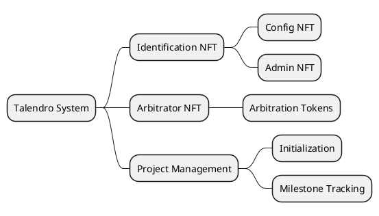
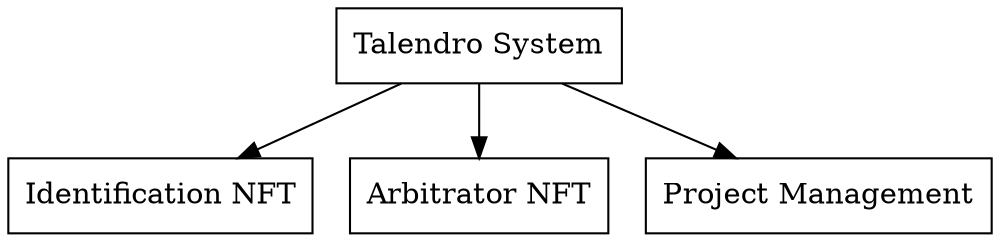

# empty

```plantuml
@startmindmap
+ Talendro System
++ Identification NFT
+++ Config NFT
+++ Admin NFT
++ Arbitrator NFT
+++ Arbitration Tokens
++ Project Management
+++ Initialization
+++ Milestone Tracking
@endmindmap
```

```dot
digraph TalendroSystem {
    rankdir=TB;
    node [shape=box];
    
    "Talendro System" -> "Identification NFT";
    "Talendro System" -> "Arbitrator NFT";
    "Talendro System" -> "Project Management";
}
```
