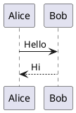
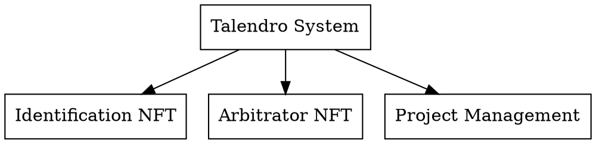
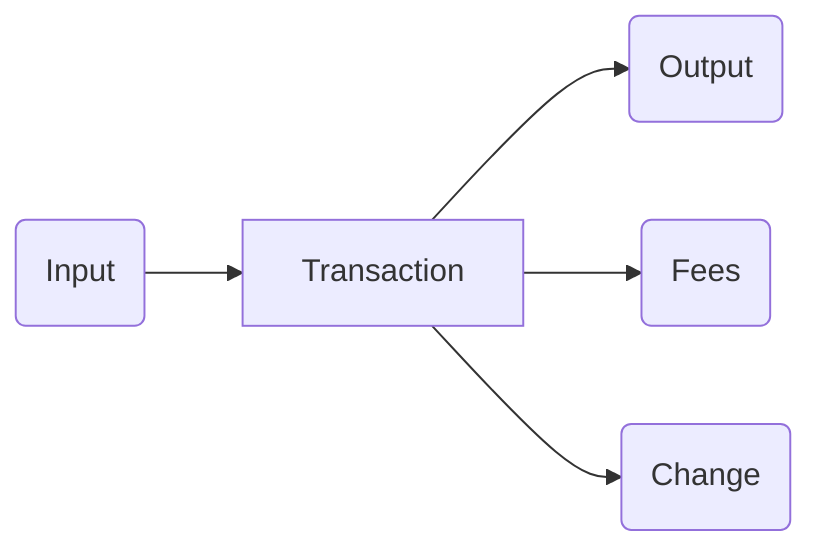

# empty

```plantuml
@startuml
Alice -> Bob : Hello
Bob --> Alice : Hi
@enduml

```

```graphviz
digraph TalendroSystem {
    rankdir=TB;
    node [shape=box];
    
    "Talendro System" -> "Identification NFT";
    "Talendro System" -> "Arbitrator NFT";
    "Talendro System" -> "Project Management";
}
```

```mermaid
graph LR
    TX[Transaction]
    I1(Input)
    O1(Output)
    O2(Fees)
    O3(Change)
    I1 --> TX
    TX --> O1
    TX --> O2
    TX --> O3
```

